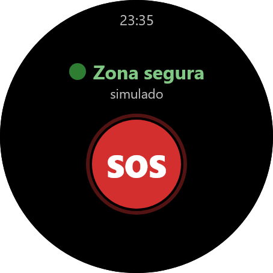
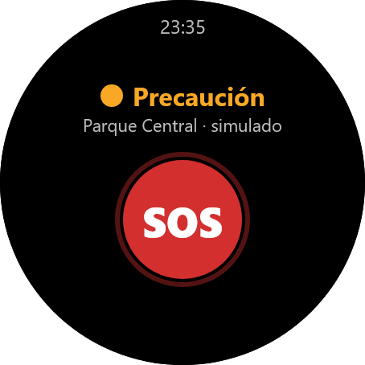
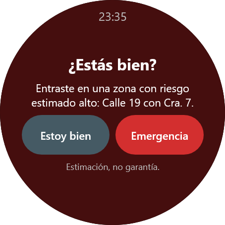
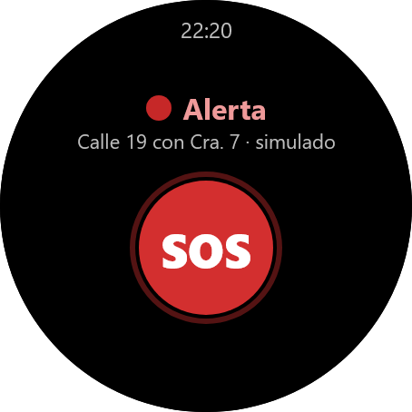
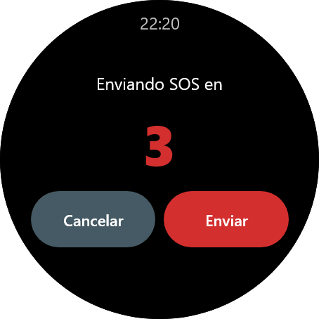
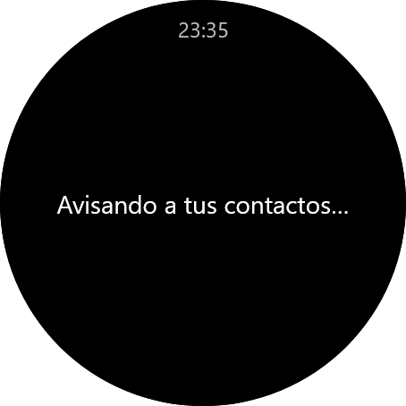
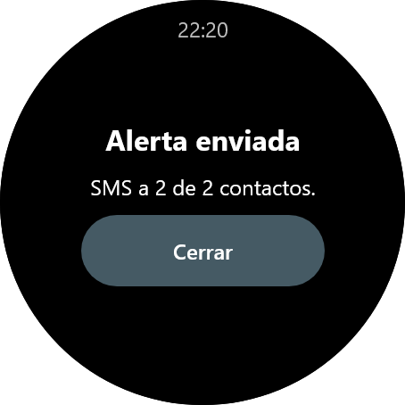
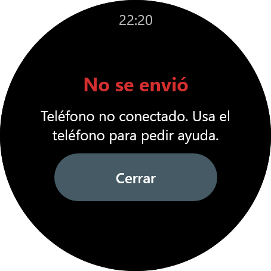
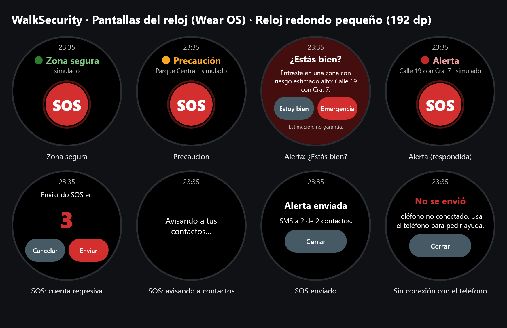
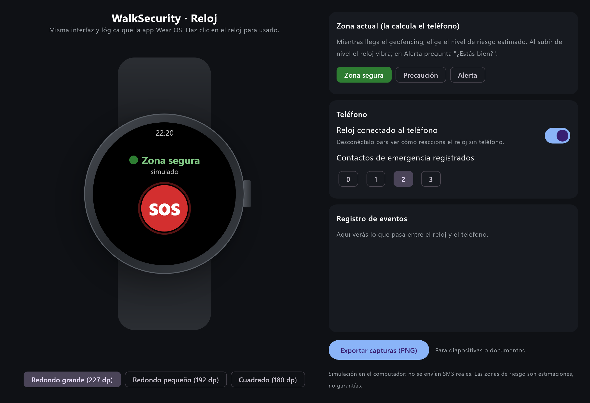

# WalkSecurity

Aplicación de seguridad personal: el reloj avisa (vibración + pantalla) cuando entras en una zona
estimada como riesgosa, y un botón SOS envía tu ubicación a tus contactos de confianza.

> **Aviso:** las zonas de riesgo son **estimaciones basadas en datos históricos**, no una garantía
> de que una persona esté o no en peligro. La app no sustituye a la línea de emergencias (123 en Colombia).

La documentación (arquitectura, cómo ejecutar y probar, página web con simulador y descargas) está en
[WalkSecurity_Documentacion](https://github.com/Andres-Maya/WalkSecurity_Documentacion).

## Capturas

       

