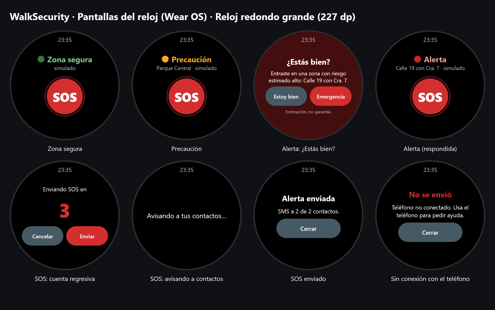

# WalkSecurity

Aplicación de seguridad personal: el reloj avisa (vibración + pantalla) cuando entras en una zona
estimada como riesgosa, y un botón SOS envía tu ubicación a tus contactos de confianza.

> **Aviso:** las zonas de riesgo son **estimaciones basadas en datos históricos**, no una garantía
> de que una persona esté o no en peligro. La app no sustituye a la línea de emergencias (123 en Colombia).



## Ver el reloj en el computador (sin smartwatch)

El módulo `watch-emulator` abre una ventana con el reloj dibujado como un dispositivo real, usando la
**misma interfaz y la misma lógica** que la app Wear OS (`watch-core`). El teléfono se simula: desde el
panel eliges la zona (segura / precaución / alerta), desconectas el teléfono o cambias los contactos,
y un registro muestra qué pasa entre reloj y teléfono. La vibración se ve como un "sacudón" del reloj.

```bash
powershell -ExecutionPolicy Bypass -File scripts/reloj-emulador.ps1
```

Capturas PNG de todas las pantallas (para diapositivas), en `docs/reloj/`:

```bash
powershell -ExecutionPolicy Bypass -File scripts/reloj-emulador.ps1 -Capturas
```

Para presentar en otro computador sin Android Studio ni Gradle, genera un ejecutable con Java incluido
(se abre con doble clic; copia la carpeta completa `WalkSecurityReloj`):

```bash
powershell -ExecutionPolicy Bypass -File scripts/reloj-emulador.ps1 -Exe
```

El ejecutable queda en `watch-emulator/build/compose/binaries/main/app/WalkSecurityReloj/`. Si algo falla al
abrirlo, el detalle queda en `%TEMP%\WalkSecurityReloj.log`.

## Arquitectura

```
Smartwatch (Wear OS)  ──Data Layer──►  App Android (teléfono)  ──REST/JWT──►  API Spring Boot  ──►  PostgreSQL
  estados + SOS                         GPS, mapa, geofencing                  usuarios, contactos,      ▲
  vibración                             SMS de emergencia                      alertas, zonas            │
                                                                                     │                   │
                                                                                     └──► Modelo IA (Python / scikit-learn)
                                                                                          estima risk_score por zona
```

Monolito modular cliente-servidor (sin microservicios por ahora):

| Carpeta    | Tecnología                           | Responsabilidad                                   |
|------------|--------------------------------------|---------------------------------------------------|
| `app/`     | Kotlin, Jetpack Compose, Maps, Fused Location | App del teléfono: componente principal     |
| `backend/` | Java 21, Spring Boot 4, JPA, Flyway  | API REST, autenticación JWT, persistencia          |
| `wear/`    | Kotlin, Compose for Wear OS          | Reloj: estados seguro/precaución/alerta, vibración, SOS |
| `watch-core/` | Kotlin Multiplatform, Compose Multiplatform | Interfaz, lógica y protocolo del reloj — un solo código para Android y escritorio |
| `watch-emulator/` | Compose Desktop                 | Emulador del reloj en el computador (demo y capturas) |
| `ml/`      | Python, scikit-learn                 | *(Fase 4)* modelo de riesgo por zona               |

### Decisiones clave

- **El SOS sale por SMS desde el teléfono**, antes que por el servidor: funciona sin datos móviles
  y sin depender de que el backend esté arriba. El servidor solo registra la alerta (historial y
  futuros canales push).
- **Offline-first:** los contactos se guardan primero en el teléfono y se sincronizan en segundo plano.
  Nunca se borra un contacto de emergencia por algo que pase en el servidor (ver `ContactsMerger`).
- **Modo local:** si no hay servidor, se puede usar la app sin cuenta (*Usar sin cuenta* en el login).
  Al crear la cuenta después, los contactos se suben solos. Si la sesión expira, la app pasa a modo local
  sin perder datos.
- **Cuenta regresiva de 5 s** antes de enviar el SOS para evitar falsas alarmas; se puede enviar
  de inmediato o cancelar.
- El envío del SOS corre en un scope de aplicación: no se cancela si el usuario cambia de pantalla.
- El GPS continuo solo está activo mientras la pantalla principal es visible (batería).
  El seguimiento en segundo plano llegará con el geofencing (fase 2) vía un Foreground Service.

### Reloj ↔ teléfono

```
Teléfono ──DataItem /walksecurity/risk-status──► Reloj   (estado persistente: SAFE | CAUTION | ALERT)
Reloj    ──Message  /walksecurity/sos──────────► Teléfono (envía SMS + registra en el API)
Teléfono ──DataItem /walksecurity/sos-result───► Reloj   (confirmación: cuántos SMS salieron)
```

- El reloj **vibra** al subir de nivel (patrón distinto para precaución y alerta) y muestra una notificación
  aunque la app esté cerrada. En **alerta** pregunta "¿Estás bien?": *Emergencia* envía el SOS de inmediato.
- El botón SOS del reloj tiene cuenta regresiva de 5 s (se puede cancelar o enviar ya).
- Ambas apps comparten `applicationId` y firma: es un requisito del Data Layer.

### Estructura de la app

```
app/src/main/java/com/andres/walksecurity/
├── AppContainer.kt          # inyección de dependencias manual
├── core/
│   ├── location/            # FusedLocationProvider → corrutinas/Flow
│   ├── model/               # modelos, validaciones, texto del SMS
│   └── sms/                 # envío de SMS
├── data/
│   ├── local/SessionStore   # DataStore: token, usuario, contactos (caché)
│   ├── remote/              # Retrofit + kotlinx.serialization
│   └── repository/          # Auth, Contacts, Alert (SOS)
└── ui/
    ├── auth/  home/  contacts/  navigation/  components/  theme/
```

## Roadmap

- [x] **Fase 1** – Registro/login, GPS, mapa, contactos de confianza, botón SOS (SMS + registro en API)
- [ ] **Fase 2** – Zonas de riesgo (API + mapa), Geofencing API en segundo plano, notificaciones y
      umbral configurable (seguro < 0.4 ≤ precaución < 0.7 ≤ alerta)
- [x] **Fase 3** *(adelantada, prioridad del proyecto)* – Módulo `wear/`: 3 estados + SOS, vibración,
      comunicación con el teléfono (Wearable Data Layer). Mientras llega la fase 2, el estado de riesgo
      se prueba con el **simulador** de la pantalla *Reloj emulado* del teléfono.
- [ ] **Fase 4** – Modelo scikit-learn (lat/lng, hora, día, histórico de incidentes) que actualiza `risk_zones.risk_score`

## Cómo ejecutar y probar en tu teléfono (sin emulador)

### 1. Backend (opcional: la app funciona en modo local sin él)

Ejecútalo en **tu propia terminal** y déjala abierta. Usa el PostgreSQL instalado en Windows
(sin Docker, mucho menos memoria), hace `adb reverse` y arranca el backend con 256 MB:

```bash
powershell -ExecutionPolicy Bypass -File scripts/dev-up.ps1
```

La **primera vez** crea la base de datos `walksecurity` y te pide la contraseña del usuario
`postgres` (la que elegiste al instalar PostgreSQL). Con `-Docker` usa PostgreSQL en Docker (puerto 5433).

Manual, con Docker:

```bash
cd backend
docker compose up -d
./gradlew bootRun
```

Comprueba: `curl http://localhost:8080/actuator/health` → `{"status":"UP"}`.

### 2. Conectar el teléfono al backend por USB

Con el teléfono conectado y la depuración USB activa:

```bash
adb reverse tcp:8080 tcp:8080
```

Así `http://127.0.0.1:8080` dentro del teléfono apunta al backend de tu PC. Hay que repetirlo
cada vez que desconectes el cable. *(Alternativa por Wi-Fi: `API_BASE_URL=http://<IP-de-tu-PC>:8080/`
en `local.properties`; solo funciona en builds debug.)*

### 3. Google Maps API key

1. En [Google Cloud Console](https://console.cloud.google.com/) habilita **Maps SDK for Android** y crea una API key.
2. Restríngela a apps Android con el paquete `com.andres.walksecurity` y el SHA-1 de tu keystore de debug
   (`./gradlew signingReport`).
3. Añádela a `local.properties` (no se sube a git):

```properties
MAPS_API_KEY=tu_api_key
```

Sin la key la app funciona igual, pero muestra un aviso en lugar del mapa.

### 4. Instalar la app

Desde Android Studio (▶ Run con el teléfono seleccionado) o:

```bash
./gradlew installDebug
```

### 5. Prueba de humo

1. Regístrate (o *Usar sin cuenta* si el backend no está corriendo) → se piden permisos de ubicación y SMS.
2. Agrega un contacto de confianza (usa **tu propio número** u otro teléfono tuyo para probar).
3. Pulsa **SOS** → cuenta regresiva → llega un SMS con el enlace de Google Maps.
4. En la consola del backend aparece `Alerta SOS #...` y el registro queda en la tabla `alerts`.

> Los SMS los cobra tu operador según tu plan.

## Probar el reloj sin tener reloj (reloj emulado)

La pantalla **Reloj emulado** del teléfono (tarjeta *Reloj* en la pantalla principal) ejecuta la
**misma interfaz y la misma lógica** del reloj (`watch-core`), dibujada en un marco redondo a escala real.
Solo cambia el transporte: en lugar del Wearable Data Layer usa llamadas directas dentro de la app.

1. Abre *Reloj emulado*.
2. En *Simular zona* pulsa **Precaución** → el teléfono vibra corto y el reloj pasa a ámbar.
3. Pulsa **Alerta** → vibración larga y el reloj pregunta *¿Estás bien?*.
   *Emergencia* envía el SOS real; *Estoy bien* lo descarta.
4. Pulsa **SOS** en el reloj → cuenta regresiva de 5 s → llegan los SMS ("desde su reloj")
   y el reloj muestra cuántos se enviaron.

```
                 ┌──────── watch-core (WatchApp + WatchController) ────────┐
Reloj Wear OS:   │ DataLayerWatchTransport ──Data Layer──► PhoneWearListenerService ──► AlertRepository
Reloj en el tel.:│ EmulatedWatchTransport ──── llamada directa ─────────────────────► AlertRepository
Computador:      │ SimulatedPhone (watch-emulator) ── todo simulado, sin SMS reales
                 └─────────────────────────────────────────────────────────┘
```

## Probar en un reloj Wear OS real

Requisitos: un reloj **Wear OS 3 o superior** (Pixel Watch, Galaxy Watch 4+, TicWatch, etc.) emparejado
con el teléfono mediante su app oficial (*Pixel Watch*, *Galaxy Wearable* o *Wear OS by Google*).

1. En el reloj: *Ajustes → Sistema → Información → toca 7 veces "Número de compilación"* para activar las
   opciones de desarrollador; luego *Opciones de desarrollador → Depuración por Wi-Fi* (reloj y PC en la misma red).
2. Empareja y conecta desde el PC (los datos aparecen en esa pantalla del reloj):

```bash
adb pair IP_DEL_RELOJ:PUERTO_DE_EMPAREJAMIENTO
```

```bash
adb connect IP_DEL_RELOJ:PUERTO
```

3. Instala **ambas** apps (misma llave de debug) y abre la del reloj:

```bash
./gradlew :app:installDebug :wear:installDebug
```

4. En el teléfono, la tarjeta del reloj debe decir "Reloj Wear OS conectado". En la pantalla *Reloj*,
   usa *Simular zona*: *Precaución* → vibración corta; *Alerta* → vibración larga y "¿Estás bien?".
5. Pulsa **SOS** en el reloj → cuenta regresiva → el teléfono envía los SMS y el reloj muestra el resultado.

## Problemas comunes

| Síntoma | Causa / solución |
|---------|------------------|
| "No se pudo conectar con el servidor" | 1) El backend no está corriendo: ejecuta `scripts/dev-up.ps1` en tu terminal. 2) `adb devices` no muestra el teléfono → reconecta el cable. 3) Falta `adb reverse tcp:8080 tcp:8080` (se pierde al desconectar). Mientras tanto usa **Usar sin cuenta (modo local)**. |
| Todo va muy lento / el backend se cae | El equipo tiene ~6 GB de RAM. Cierra Docker Desktop (usa `dev-up.ps1` sin `-Docker`) y lo que no uses. Kotlin compila dentro de Gradle (`gradle.properties`) para no abrir otro proceso. |
| Docker Desktop se cierra al iniciar con `...dockerInference` o `engine.sock: The file cannot be accessed by the system` | Sockets huérfanos de una sesión anterior. Con Docker cerrado, renombra `%LOCALAPPDATA%\Docker\run` y `%LOCALAPPDATA%\docker-secrets-engine` y vuelve a abrir Docker. |
| `la autentificación password falló para el usuario "walksecurity"` | Un PostgreSQL instalado en Windows ocupa el 5432. El contenedor usa el **5433** para evitarlo. |

## Tests

```bash
./gradlew :app:testDebugUnitTest :watch-core:desktopTest
```

```bash
cd backend && ./gradlew test
```
